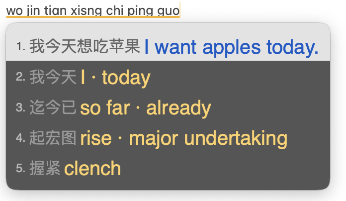
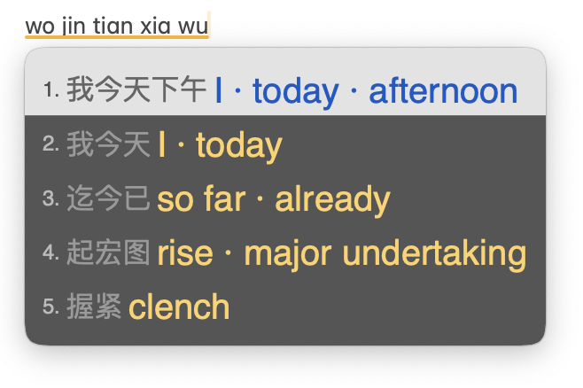

# 打中文，顺便背单词

**type-chinese-learn-english** · 一个 macOS 输入法扩展：每个中文候选词旁边都显示英文。

基于 macOS 上的 Rime 输入法（鼠须管 + 雾凇拼音），**全部本地运行，不联网上传任何输入内容**。

- **词**：查本地词表（13 万条），显示 1–2 个常用英文，例如「质量 quality」「握紧 clench」。
- **整句**：首选候选交给本机翻译模型（OPUS-MT，CTranslate2 int8），例如「明天下午三点开会 We'll meet tomorrow at 3:00 p.m.」。
- **半句**：逐词对照，不让模型“脑补”，例如「我今天下午 I · today · afternoon」。
- **纠错**：键盘邻键纠错（按偏到相邻键的单个字母）+ 雾凇自带的字母顺序纠错。
- **组句**：雾凇拼音 + 万象简体语法模型。

| 整句：首选交给本机模型翻译 | 半句：逐词对照，不让模型脑补 |
|---|---|
|  |  |
| 输入时把 `xiang` 打成了 `xisng`（a、s 相邻），邻键纠错照样给出「想」 | 「我今天下午」显示 I · today · afternoon，而不是模型编出的 "I'm going to be here this afternoon." |

> 目前只提供 macOS 版。iPhone（仓输入法）版尚未在真机上测试，测试通过后再加入本仓库。

## 工作原理

```
拼音 ─▶ 雾凇拼音(+万象语法模型) ─▶ 候选 ─▶ cn2en.lua 过滤器 ─▶ 候选 + 英文注释
                                            │
                     词表命中 ◀── cn2en.tsv ─┤
                     首选整句 ──▶ 127.0.0.1:18085 本机翻译服务（超时 0.3 秒即放弃，不卡打字）
                     其余半句 ──▶ 正向最大匹配，逐词对照
```

- 首选候选的模型译文，如果英文词数远多于原文实词数，判定为模型给半句脑补了内容，改用逐词对照。
- 语气词（了、吗、呢、吧……）：首选候选带语气词时 2 个字起就整句翻译（「下雨了 It's raining.」）；逐词对照时跳过语气词，句末是「吗 / 呢」则补问号（「饿了吗 hungry?」）。
- 一页候选打包成一次请求；词表只在启动时加载一次；译文两级缓存（Lua 侧 + 服务侧）。
- 实测（Apple M1）：一页 5 个候选整批翻译 70–100ms，缓存命中约 10ms。

## 安装（macOS）

需要 [Homebrew](https://brew.sh)、Python 3。以下命令都在终端里执行。

### 1. 安装鼠须管

```sh
brew install --cask squirrel   # 会要求输入开机密码
```

然后在「系统设置 → 键盘 → 文字输入 → 输入法 → 编辑… → +」里添加「简体中文 → 鼠须管」。

### 2. 备份并放入雾凇拼音

```sh
[ -d ~/Library/Rime ] && cp -R ~/Library/Rime ~/Library/Rime.bak-$(date +%Y%m%d-%H%M)
git clone --depth 1 https://github.com/iDvel/rime-ice.git /tmp/rime-ice
rsync -a --ignore-existing --exclude .git --exclude .github --exclude others --exclude build \
  /tmp/rime-ice/ ~/Library/Rime/
```

### 3. 放入本仓库的配置和词表

```sh
git clone https://github.com/wjunlin293-tech/type-chinese-learn-english.git ~/type-chinese-learn-english
cd ~/type-chinese-learn-english
mkdir -p ~/Library/Rime/lua
cp mac/default.custom.yaml mac/rime_ice.custom.yaml mac/squirrel.custom.yaml ~/Library/Rime/
cp mac/lua/cn2en.lua data/cn2en.tsv ~/Library/Rime/lua/
```

### 4. 下载万象语法模型（约 400MB，可选但强烈建议）

```sh
curl -L -o ~/Library/Rime/wanxiang-lts-zh-hans.gram \
  https://github.com/amzxyz/RIME-LMDG/releases/download/LTS/wanxiang-lts-zh-hans.gram
```

不装也能用，只是整句组词会差一些；此时请把 `rime_ice.custom.yaml` 里 `grammar/` 开头的两行删掉。

### 5. 安装本机翻译服务（可选，用于整句翻译）

```sh
mkdir -p ~/Library/Rime/mt
cp mac/mt/server.py ~/Library/Rime/mt/
python3 -m venv ~/Library/Rime/mt/venv
~/Library/Rime/mt/venv/bin/pip install ctranslate2 sentencepiece
./tools/convert_model.sh            # 下载并转换模型（临时占用约 1GB，转完自动清理），输出到 ~/Library/Rime/mt/model
sed "s#__HOME__#$HOME#g" mac/mt/local.cn2en-mt.plist.template > ~/Library/LaunchAgents/local.cn2en-mt.plist
launchctl bootstrap gui/$(id -u) ~/Library/LaunchAgents/local.cn2en-mt.plist
curl -s "http://127.0.0.1:18085/t?q=%E4%BD%A0%E5%A5%BD"   # 应返回 Hello.
```

不装这一步，词和半句照常显示英文，只是首选整句没有通顺译文。

### 6. 部署

```sh
"/Library/Input Methods/Squirrel.app/Contents/MacOS/Squirrel" --reload
```

或在菜单栏鼠须管图标里点「重新部署」。

## 测试清单

| 输入 | 首选候选 | 应看到的英文 |
|---|---|---|
| `pingguo` | 苹果 | apple |
| `zhiliang` | 质量 | quality |
| `wojintianxiawu` | 我今天下午 | I · today · afternoon |
| `mingtianxiawusandiankaihui` | 明天下午三点开会 | We'll meet tomorrow at 3:00 p.m. |
| `xuexiyingyuhenzhongyao` | 学习英语很重要 | Learning English is important. |

整句译文来自模型，组句结果随词库版本可能略有不同。

## 文件说明

| 路径 | 作用 |
|---|---|
| `mac/lua/cn2en.lua` | Rime Lua 过滤器：查词表、整句请求本机翻译、半句逐词对照 |
| `mac/rime_ice.custom.yaml` | 雾凇拼音补丁：挂载过滤器、万象语法模型、邻键纠错（不改原方案文件） |
| `mac/squirrel.custom.yaml` | 鼠须管外观：英文 20 号暖黄、中文 16 号灰色 |
| `mac/default.custom.yaml` | 方案菜单只保留雾凇拼音 |
| `mac/mt/server.py` | 本机翻译服务，只监听 127.0.0.1，不记录任何输入 |
| `mac/mt/local.cn2en-mt.plist.template` | 开机自启（LaunchAgent）模板 |
| `data/cn2en.tsv` | 中文 → 英文词表（约 13.2 万条） |
| `data/overrides.tsv` | 手工校正表，优先级最高 |
| `data/cn2en_ecdict_reverse.tsv` | ECDICT 反查表，CC-CEDICT 未收录时的回退 |
| `tools/build_cn2en.py` | 生成 `cn2en.tsv` |
| `tools/build_ecdict_reverse.py` | 生成 `cn2en_ecdict_reverse.tsv` |
| `tools/convert_model.sh` | 下载并转换 OPUS-MT 模型 |

## 自己修正翻译

发现某个词翻得不准，在 `data/overrides.tsv` 里加一行 `中文<TAB>英文`，然后重新生成词表：

```sh
# 准备数据源（CC-CEDICT 与 ECDICT）
curl -L -o /tmp/cedict.zip https://www.mdbg.net/chinese/export/cedict/cedict_1_0_ts_utf-8_mdbg.zip && unzip -o /tmp/cedict.zip -d /tmp
curl -L -o /tmp/ecdict.csv https://raw.githubusercontent.com/skywind3000/ECDICT/master/ecdict.csv

python3 tools/build_cn2en.py /tmp/cedict_ts.u8 /tmp/ecdict.csv \
  data/cn2en_ecdict_reverse.tsv data/cn2en.tsv data/overrides.tsv
cp data/cn2en.tsv ~/Library/Rime/lua/
"/Library/Input Methods/Squirrel.app/Contents/MacOS/Squirrel" --reload
```

## 外观

鼠须管 1.1.2 的候选框不支持把注释画在候选词**上方**：在 `candidate_format` 里插入换行会导致面板高度计算错误、内容跳到最后一行。所以英文显示在中文**右侧**，用更大的字号和更醒目的颜色区分。颜色在 `mac/squirrel.custom.yaml` 里改（格式为 `0xBBGGRR`）。

## 已知局限

- 英文在候选词右侧，不在正上方（见上节）。
- 词表对多义词只取 1–2 个最常用的英文，具体语境下可能不是最合适的那个。
- 本地小模型整句翻译偶尔会漏意思，例如「我今天想吃苹果 → I want apples today.」漏掉了「吃」。
- 逐词对照只是词的拼接，不是通顺的英文句子。
- 翻译服务常驻后台，约占 200–300MB 内存。
- 邻键纠错只纠正单个字母。

## 卸载

按需要选择程度：

```sh
# 只关掉英文显示：删掉 rime_ice.custom.yaml 中 engine/filters/+ 那两行，然后重新部署

# 去掉本机翻译服务
launchctl bootout gui/$(id -u)/local.cn2en-mt
rm ~/Library/LaunchAgents/local.cn2en-mt.plist
rm -rf ~/Library/Rime/mt

# 彻底删除鼠须管及全部配置（先在「系统设置 → 键盘 → 输入法」里移除鼠须管）
brew uninstall --cask squirrel
rm -rf ~/Library/Rime        # 如有备份：mv ~/Library/Rime.bak-<日期> ~/Library/Rime
```

## 许可

- 代码与配置（`mac/`、`tools/`）：[MIT](LICENSE)
- 词表数据（`data/cn2en.tsv`、`data/overrides.tsv`）：CC BY-SA 4.0，衍生自 CC-CEDICT；ECDICT 部分为 MIT。详见 [data/LICENSE.md](data/LICENSE.md)
- 引用的第三方组件：见 [THIRD_PARTY_NOTICES.md](THIRD_PARTY_NOTICES.md)
